  
  
  

 

## About

I'm a full-stack web developer building practical, end-to-end systems — from database schema to backend logic to the interface people actually use. My work spans web, desktop (Electron), and service-oriented backends, usually for operational software like inventory, catering, and hospitality management.

I care about writing systems that hold up under real usage, not just demos. Every project below is a rep — I ship, find what breaks, and level up the next iteration.

**Education:** BS Information Systems

## Currently Building

- **CaterSync-AI** — a multi-tenant, AI-assisted catering management platform (Svelte + JavaScript, with a Python/PLpgSQL data layer)
- **Catering-Electron** — a desktop client for catering operations, built with Electron, Python, and Svelte
- **jayraldinescateringsystem** — a Python-based catering operations system with a PostgreSQL backend and JS-driven UI
- **inventory-testing** — an inventory management interface built with Svelte + TypeScript

 

  

## Tech Stack

**Languages**

  
  
  
  
  
  

**Frontend**

  
  
  

**Backend**

  
  
  
  
  

**Desktop Development**

  
  

**Databases**

  
  
  

**IDEs & Editors**

  
  
  
  
  

**Tools & DevOps**

  
  
  
  
  
  
  

  

## Featured Projects

<table>
<tr>
<td width="50%" valign="top">

**[CaterSync-AI](https://github.com/villariasa/CaterSync-AI)**
Multi-tenant, AI-assisted catering management platform with cross-platform support and dynamic branding, per the project's own description.
`Svelte` `JavaScript` `Python` `PL/pgSQL`

</td>
<td width="50%" valign="top">

**[Catering-Electron](https://github.com/villariasa/Catering-Electron)**
Desktop catering-operations client built as an Electron app.
`Python` `Svelte` `TypeScript` `PowerShell`

</td>
</tr>
<tr>
<td width="50%" valign="top">

**[jayraldinescateringsystem](https://github.com/villariasa/jayraldinescateringsystem)**
Python-driven catering operations system with a PostgreSQL data layer and a JavaScript/HTML front end.
`Python` `JavaScript` `PL/pgSQL`

</td>
<td width="50%" valign="top">

**[inventory-testing](https://github.com/villariasa/inventory-testing)**
Inventory management interface built with Svelte and TypeScript.
`Svelte` `TypeScript`

</td>
</tr>
<tr>
<td width="50%" valign="top">

**[Hotel-Management](https://github.com/villariasa/Hotel-Management)**
Hotel management application built with JavaScript and HTML.
`JavaScript` `HTML`

</td>
<td width="50%" valign="top">

**[ui-hotel](https://github.com/villariasa/ui-hotel)**
Hotel-facing UI project built with JavaScript, HTML, and CSS.
`JavaScript` `HTML` `CSS`

</td>
</tr>
</table>

  

## GitHub Stats

  
  

  

  

## Anime & Manhwa

  
  

  Each row below auto-scrolls in a single continuous line (pure CSS animation inside a self-contained SVG — no JavaScript, works natively on GitHub). The pills above and the <code>&lt;details&gt;</code> toggles below are the actual user-clickable interaction: GitHub renders static Markdown/HTML, so a JS-driven animated tab switch isn't possible here — expand/collapse is the closest real equivalent.

<b>▸ Anime Watchlist (20)</b> — click to collapse

 

  

1. [Solo Leveling](https://anilist.co/anime/151807) ★ Favorite
2. [Bleach](https://anilist.co/anime/269) ★ Favorite
3. [Tokyo Ghoul](https://anilist.co/anime/20605) ★ Favorite
4. [Jujutsu Kaisen](https://anilist.co/anime/113415) ★ Favorite
5. [That Time I Got Reincarnated as a Slime](https://anilist.co/anime/101280)
6. [Mushoku Tensei: Jobless Reincarnation](https://anilist.co/anime/108465)
7. [Re:ZERO -Starting Life in Another World-](https://anilist.co/anime/21355)
8. [Overlord](https://anilist.co/anime/20832)
9. [The Eminence in Shadow](https://anilist.co/anime/130298)
10. [Sword Art Online](https://anilist.co/anime/11757)
11. [KonoSuba](https://anilist.co/anime/21202)
12. [No Game No Life](https://anilist.co/anime/19815)
13. [The Rising of the Shield Hero](https://anilist.co/anime/99263)
14. [Demon Slayer: Kimetsu no Yaiba](https://anilist.co/anime/101922)
15. [Attack on Titan](https://anilist.co/anime/16498)
16. [Naruto / Naruto: Shippuden](https://anilist.co/anime/1735)
17. [One Piece](https://anilist.co/anime/21)
18. [Hunter x Hunter](https://anilist.co/anime/136)
19. [Fullmetal Alchemist: Brotherhood](https://anilist.co/anime/5114)
20. [The Misfit of Demon King Academy](https://anilist.co/anime/112301)

<b>▸ Manhwa Reading Rotation (20)</b> — click to expand

 

  

1. [Revenge of the Iron-Blooded Sword Hound](https://anilist.co/manga/163824)
2. [The Great Mage Returns After 4000 Years](https://anilist.co/manga/118424)
3. Necromancer's Evolutionary Traits — cover art unverified
4. [The Reincarnated Assassin Is a Genius Swordsman](https://anilist.co/manga/168823)
5. [Lookism](https://anilist.co/manga/86848) ★ Favorite
6. [Star-Embracing Swordmaster](https://anilist.co/manga/170400)
7. [The Return of the Disaster-Class Hero](https://anilist.co/manga/143056)
8. Regression Instruction Manual — cover art unverified
9. [Eleceed](https://anilist.co/manga/106929) ★ Favorite
10. [The Regressed Mercenary's Machinations](https://anilist.co/manga/182066)
11. [Absolute Regression](https://anilist.co/manga/180891)
12. [Catastrophic Necromancer](https://anilist.co/manga/188225)
13. Chronicles of the Martial Gods' Return — cover art unverified
14. [Return to Player](https://anilist.co/manga/124577)
15. [Absolute Sword Sense](https://anilist.co/manga/151460)
16. [Legend of the Northern Blade](https://anilist.co/manga/119521)
17. [Eternally Regressing Knight](https://anilist.co/manga/177706)
18. [Infinite Mage](https://anilist.co/manga/159930)
19. [Reality Quest](https://anilist.co/manga/141705)
20. [Return of the Mount Hua Sect](https://anilist.co/manga/132144) ★ Favorite

  

Still iterating. Still shipping. Still leveling up.

